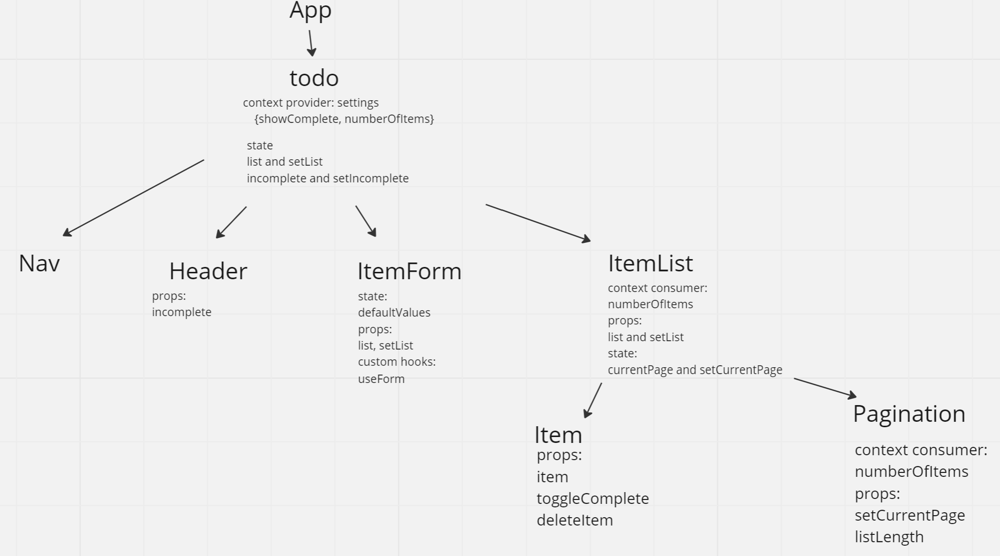

# To-Do App

## Overview
This application is for keeping track of tasks, who is assigned the tasks, and how difficult each task is. The current version of the application allows you to submit the task with an assignee and difficulty level attached to it. The tasks show in a list to the right. You can change the status of the task in the list from incomplete to complete. A count of uncompleted tasks show at the top. Before this happens, a user must sign up if they haven't before or sign in if they have already signed up. The users are stored in a SQL database. The server with the database authenticates the user and returns a token. The token is what allows the user to read, create, update, and delete their tasks. The tasks are stored in the database on the server as well.

[Deployed Site](https://symphonious-granita-4b24da.netlify.app/)

## UML

## Available Scripts

In the project directory, you can run:

### `npm start`

Runs the app in the development mode.\
Open [http://localhost:3000](http://localhost:3000) to view it in your browser.

The page will reload when you make changes.\
You may also see any lint errors in the console.

### `npm test`

Launches the test runner in the interactive watch mode.\
See the section about [running tests](https://facebook.github.io/create-react-app/docs/running-tests) for more information.

### `npm run build`

Builds the app for production to the `build` folder.\
It correctly bundles React in production mode and optimizes the build for the best performance.

The build is minified and the filenames include the hashes.\
Your app is ready to be deployed!

### Change Logs
oct-30-2022 @ 1830 - Add starter code

oct-31-2022 @ 1330 - Modularize react components, use context for settings, and add pagination

nov-02-2022 @ 1500 - Add settings context and sort/filter lib

nov-03-2022 @ 2130 - Add login context, add sign up and sign in form, only lets user access app when authenticated

nov-04-2022 @ 1920 - Users and tasks are stored in a database, added lib to make requests to server

### Resource
[Blueprint](https://blueprintjs.com/docs/)